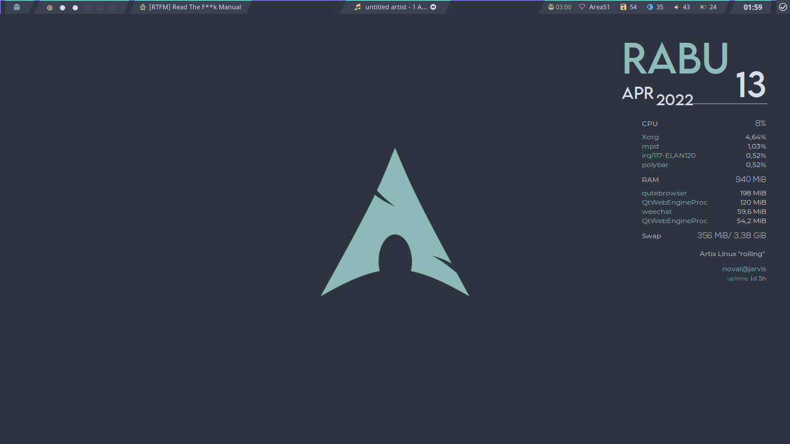

# Intro
 
it's my personal dotfiles with [gruvbox colorscheme](https://github.com/morhetz/gruvbox">gruvbox colorscheme)

### Requirements
- bspwm
- rxvt-unicode
- urxvt-perl
- zsh
- neofetch
- mpd
- ncmpcpp
- Rofi
- vifm
---
